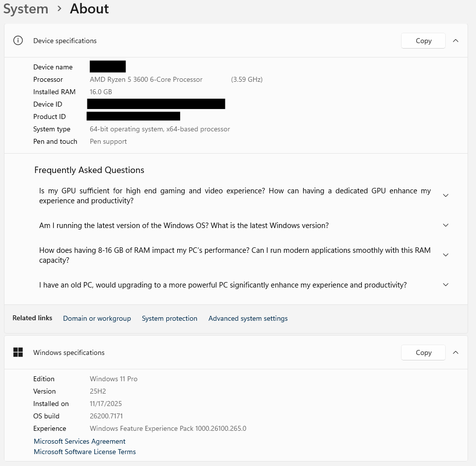

# Task 01 - System Information Audit

## Purpose   
Before we troubleshoot any problems, the first step is to *understand the sysytem information*.   

This establishes a baseline to identify:   
- Hardware limitations
- OS version and build
- Patch level
- System uptime
- Installed RAM and CPU perfomance expectations
- Whether issues may be caused by outdated or unsupported components

## Tools Used
- Windows 11 **Settings → System → About**
  - Shows Windows edition (Home/Pro)
  - Shows processor and installed RAM
  - Confirms system type (64-bit)
  - Confirms device name
  - 

    
Why do we use this:  
It is the fastest way to understand what machine we are working on before we begin troubleshooting.

- **winver** command
  - Confirms major Windows version (e.g., 22H2, 23H2)
  - Confirms build number
  - Helps determine whether bugs are due to outdated or unsupported builds  
    
Why do we use this:  
**winver** tells us if the system is too old or missing important updates.

- **systeminfo** command (CMD)
  - OS version, build, and install date
  - System model & manufacturer
  - BIOS version
  - Physical memory
  - Hotfix (update) history
  - Network adapter info
  - System uptime  
  
Why do we use this:  
It generates a full system baseline report for documentation and deeper troubleshooting.
This is your “technical details” dump.
