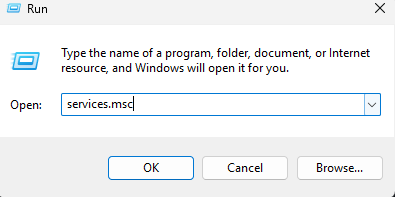
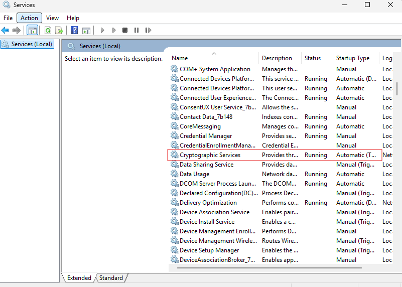
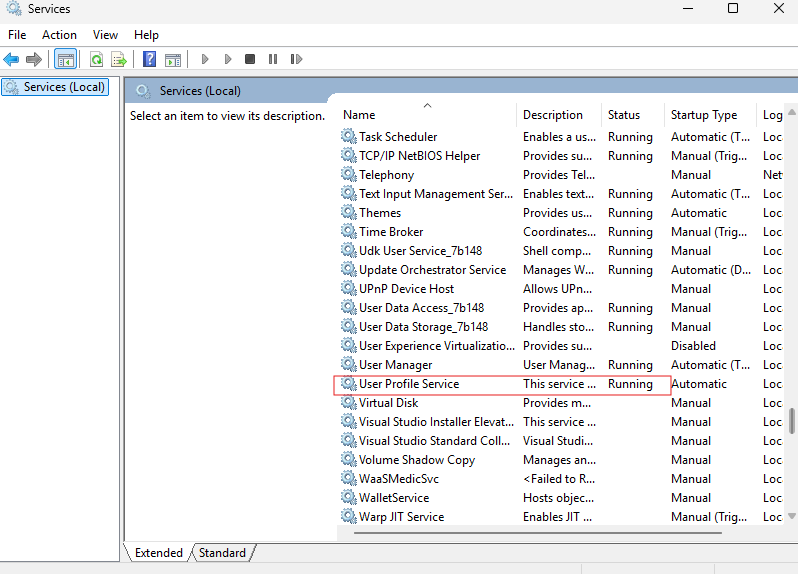
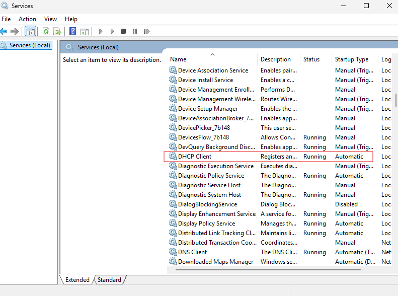

# Task 03 – Services Inspection

## Purpose
Many Windows problems, especially login failures, random sign-outs, slow performance, Windows Update issues, and network connectivity problems occur because required services are:
  - stopped  
  - disabled  
  - stuck in “starting”  
  - failing repeatedly  

This task verifies that essential Windows services are running properly and set to the correct startup type.  

## Tools Used
1. services.msc

What it does:
  - Lets you view all system services  
  - Shows status (Running, Stopped)  
  - Shows startup type (Automatic, Manual, Disabled)  
  - Allows restarting failing services  
  - Shows dependencies to understand what each service relies on  
      
Why we use this:  
Misconfigured or stopped services create a chain reaction of failures.  
This tool reveals the exact state of each service in real time.  

## Procedure
1. Open the services console  
  - Press Win + R  
  - Type **services.msc**  
  - Press Enter  
    
2. Verify essential Windows Update services  
   These services must be Running and Automatic/Manual:  
   
  - Windows Update (wuauserv)  
  - Background Intelligent Transfer Service (BITS)  
  - Cryptographic Services  
  - Windows Installer  
  - Update Orchestrator Service  
    
3. Verify Login-related services  
   These services impact profile loading, credentials, and user logon:  
  - User Profile Service  
  - Credential Manager  
  - Workstation  
  - Server  
    
  Action:  
    - Confirm they are set to Automatic  
    - Confirm they are not stuck in “Starting”  
4. Verify Network-related services  
   These services affect Wi-Fi, DHCP, DNS, and overall connectivity:  
  - DHCP Client  
  - DNS Client  
  - Network Location Awareness  
  - WLAN AutoConfig  
  - Network Connectivity Assistant  
    
  Action:  
    - Make sure none of these are disabled  
5. Check for failing services  
   Look for services showing:  
  - "Stopped" when set to Automatic  
  - Constant restarts  
  - Errors when starting  
  - “Access denied” or “Dependency failed” messages  
